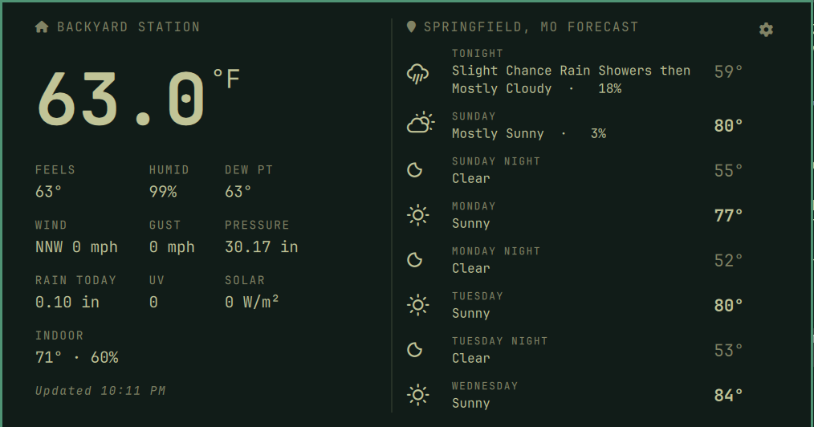

# Ambient Weather for Omarchy

A bar widget for the [Omarchy](https://omarchy.org) shell that shows your
[Ambient Weather](https://ambientweather.net) station's outdoor temperature next to
the current forecast icon. Click it to open a panel with your station's live readings
on the left and the National Weather Service forecast on the right.



## Install

```bash
omarchy plugin add https://github.com/mattwolfgang/omarchy-ambient-weather.git --enable
```

Then click the widget, press the gear icon, and enter your settings.

## Settings

Everything is entered in the panel's settings view (the gear icon, top right):

| Field | |
|---|---|
| Application key, API key | Required. Create both at [ambientweather.net/account/keys](https://ambientweather.net/account/keys). |
| Station MAC | Optional. Picks a station when your account has more than one. Otherwise the first station is used. |
| Station IP | Optional. If you leave the MAC blank, the plugin reads the MAC from your console's local web interface when you save. This works with consoles running AMBWeatherPro firmware, such as the WS-2902. |
| Forecast location | Optional. Search for a city and pick a result, or type a latitude and longitude. |

If you don't set a location, the forecast uses Omarchy's weather location (the one
set in the built-in weather panel), or else the coordinates saved on your Ambient
station.

Settings are saved to `config.json` in the plugin folder, with permissions that let only
you read it. The file is gitignored, so `omarchy plugin update` never touches it.
`config.example.json` shows its format if you'd rather edit it by hand.

The refresh interval (default 5 minutes) is a bar setting:
`omarchy bar set io.github.mattwolfgang.ambient-weather refreshMinutes 10`.

## Usage

- Left click: open or close the panel. Middle click, or Enter in the panel: refresh.
- IPC: `omarchy-shell io.github.mattwolfgang.ambient-weather toggle|open|close|refresh|settings`

## Requirements and limits

- `python3` (standard library only). No other dependencies.
- Readings come from the Ambient Weather cloud API and are shown in US units (°F, mph, inches).
- The forecast comes from the US National Weather Service, which needs no key but only covers US locations.
- Location search uses the free [Open-Meteo geocoding API](https://open-meteo.com/en/docs/geocoding-api).

## Remove

```bash
omarchy plugin remove io.github.mattwolfgang.ambient-weather
```

This deletes the plugin folder and your saved `config.json` along with it. The
forecast cache in `~/.cache/io.github.mattwolfgang.ambient-weather` can also be deleted.

## License

[MIT](LICENSE)
